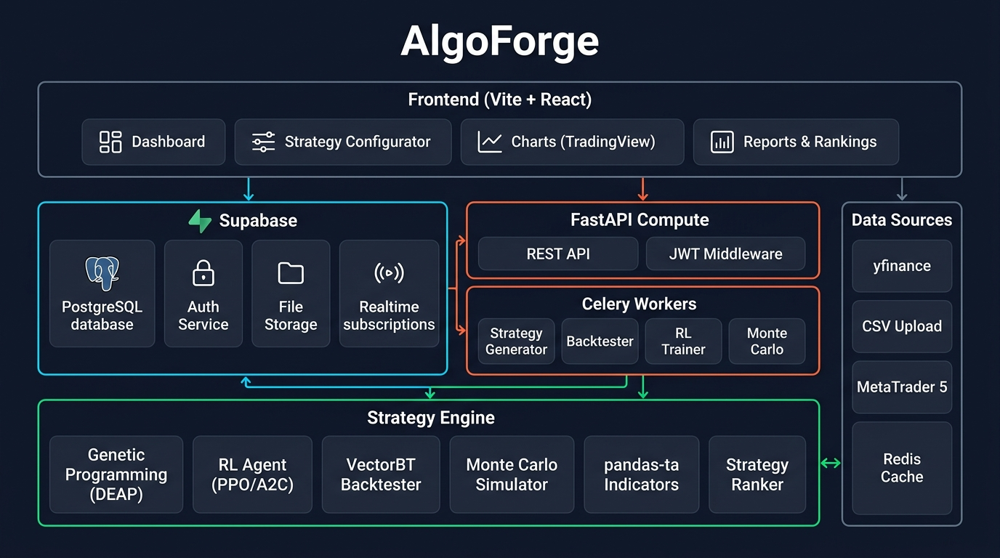

# 🧠 AlgoForge

**AI-Powered Trading Strategy Generator** — A StrategyQuant-inspired platform that uses Genetic Programming, Reinforcement Learning, and Monte Carlo simulations to discover, optimize, and validate trading strategies.



## Features

- 🧬 **Genetic Programming** — Evolve trading strategies using DEAP
- 🤖 **Reinforcement Learning** — PPO/A2C agents via Stable-Baselines3
- 📊 **130+ Technical Indicators** — Powered by pandas-ta
- ⚡ **High-Speed Backtesting** — VectorBT vectorized engine
- 🎲 **Monte Carlo Validation** — 1000+ simulations per strategy
- 📈 **Strategy Ranking** — Composite scoring (Sharpe, MC robustness, drawdown, win rate)
- 📤 **Code Export** — Generate MT5 (.mq5) and Pine Script v5
- 🔐 **Multi-User** — Supabase Auth with Row Level Security
- 🌐 **Multi-Market** — Forex, Indices, Crypto, Stocks

## Tech Stack

| Layer | Technologies |
|---|---|
| **Frontend** | Vite + React 18 + TypeScript |
| **Backend** | FastAPI + Celery + Redis |
| **Database** | Supabase (PostgreSQL + Auth + Storage + Realtime) |
| **ML/AI Engine** | DEAP, Stable-Baselines3, VectorBT, pandas-ta |
| **Data Sources** | yfinance, CSV upload, MetaTrader 5 |

## Quick Start

### Prerequisites
- Python 3.11+
- Node.js 18+
- Redis
- Supabase account (or self-hosted)

### Backend
```bash
cd backend
python -m venv venv
source venv/bin/activate
pip install -r requirements.txt
cp .env.example .env  # Configure your Supabase keys

# Start FastAPI
uvicorn algoforge.main:app --reload --port 8000

# Start Celery worker (separate terminal)
celery -A workers.celery_app worker --loglevel=info --pool=prefork --concurrency=4
```

### Frontend
```bash
cd frontend
npm install
cp .env.example .env  # Configure Supabase URL and anon key
npm run dev
```

## Architecture

See [docs/architecture.jpg](docs/architecture.jpg) for the full system diagram.

## License

MIT
